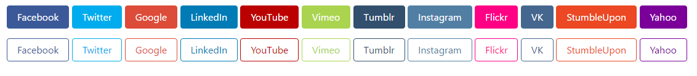
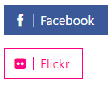
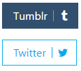

# Bootstrap Social Buttons
Common social media buttons for Bootstrap 4



## Implementation

This file is meant to be used with Bootstrap 4 Sass source code. To begin, add the partial Scss file `_social-buttons.scss` to the Bootstrap folder `scss`, this will likely be in the `vendor/twbs/bootstrap` folder if you are using Composer.

Then, modify the file `bootstrap.scss` to import the social buttons on the line after it imports normal buttons:
``` sass
@import 'buttons';
@import 'social-buttons';
```

Then use the compiler of your choice to recompile the Bootstrap Scss down to CSS and you're good to go!

## Usage

to get normal buttons:
``` html
<button class="btn btn-social-facebook">Facebook</button>
<button class="btn btn-social-twitter">Twitter</button>
```

to get outlined buttons:
``` html
<button class="btn btn-outline-social-instagram">Instagram</button>
<button class="btn btn-outline-social-google-plus">Google Plus</button>
```

## Icons

icons on the left:



``` html
<button class="btn btn-social-facebook btn-icon-left"><i class="fa fa-facebook"></i> Facebook</button>
<button class="btn btn-outline-social-flickr btn-icon-left"><i class="fa fa-flickr"></i> Flickr</button>
```


icons on the right:



``` html
<button class="btn btn-social-tumblr btn-icon-right">Tumblr <i class="fa fa-tumblr"></i></button>
<button class="btn btn-outline-social-twitter btn-icon-right">Twitter <i class="fa fa-twitter"></i></button>
```

